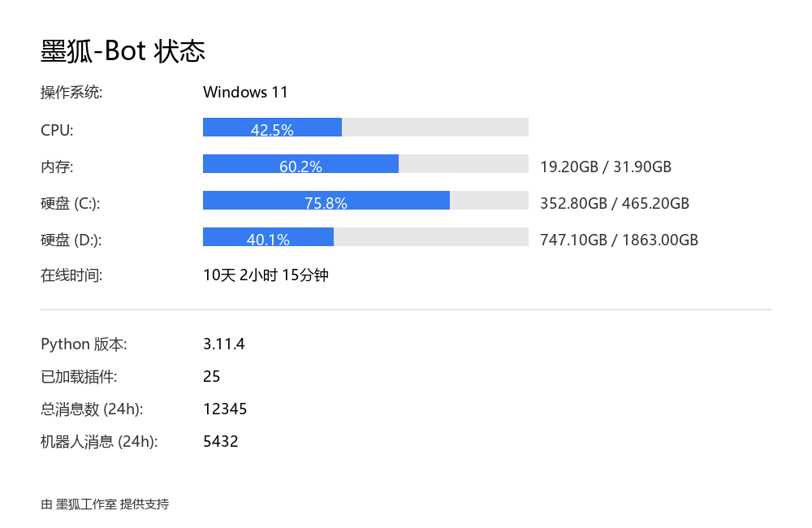

> **这是一个插件模板仓库**
>
> 这个仓库旨在为 MoFox-Bot 的插件开发者提供一个标准化的项目结构和开发起点。
> 你可以将其用作新插件开发和你插件仓库的脚手架，仓库内包含了一个功能完备且可直接使用的 `bot_status` 插件作为教学示例，清晰地展示了插件的完整开发流程和插件仓库的文件结构。

## 📂 文件结构

```
.
├── bot_status/               # 插件主目录
│   ├── __init__.py           # 插件入口文件，定义插件元信息
│   ├── plugin.py             # 插件核心逻辑，负责指令处理
│   └── 其他文件....           # 你可以根据需要添加更多模块和资源文件
│
├── __init__.py               # 仓库根部的 `__init__.py` 使其成为一个可被识别的插件包
├── preview.png               # 项目预览图片
└── README.md                 # 当然是这个你正在看的说明文件啦
```

# Bot Status Plugin

这是一个为 MoFox-Bot 设计的状态查询插件，可以通过指令生成一张包含机器人和系统实时状态的图片。

## ✨ 功能预览



## 🚀 主要特性

- **系统信息**: 实时显示操作系统、CPU 使用率、内存（RAM）占用和磁盘空间。
- **运行状态**: 展示机器人的持续运行时间（Uptime）。
- **环境信息**: 显示 Python 版本号。
- **插件统计**: 统计当前加载的插件总数。
- **消息统计**: 汇总过去 24 小时内接收和发送的消息总数。
- **品牌化设计**: 界面简洁美观，页脚包含 "Powered by MoFox-Studio"。

## 📝 使用方法

向机器人发送以下指令即可触发：

- `/status`
- `状态`
- `zt`

## ⚙️ 权限节点

- `bot_status.access`: 允许用户使用 `/status` 命令。

## 📦 依赖库

- `psutil`
- `Pillow`